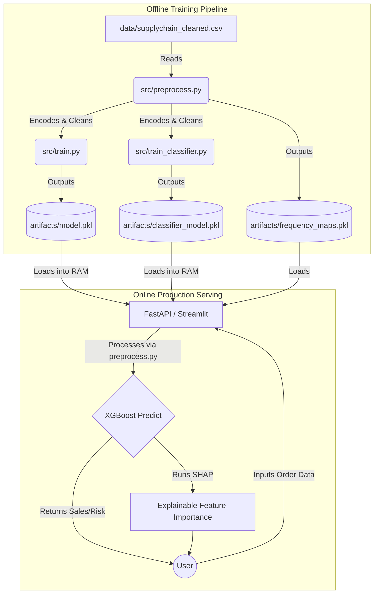

# Deep-Dive Technical Architecture & Project Report
**Project Name:** Supply Chain Analytics & Predictive Modeling System  
**Core Technologies:** Python, Scikit-Learn, XGBoost, FastAPI, Streamlit, Docker, GitHub Actions, SHAP (Explainable AI)

---

## 1. Executive Summary
This project is an end-to-end, production-grade Machine Learning system designed for Supply Chain operations. It features a **Dual-Model Architecture**:
1. **Sales Regression Model:** Predicts the exact revenue of an order.
2. **Late Delivery Classification Model:** Predicts the probability of an order failing to meet its scheduled delivery date.

Unlike basic, academic ML projects, this system handles enterprise-level engineering challenges including **target leakage prevention**, **idempotent data pipelines**, **asynchronous API model loading**, and **Explainable AI (XAI)**.

---

## 2. System Architecture & Data Flow

The system is cleanly decoupled into three layers: 
1. **The Training Pipeline (Offline):** Ingests raw CSV data, preprocesses it, trains XGBoost algorithms, and saves serialized artifacts (`.pkl` files) to disk.
2. **The API Service (Online Backend):** A high-performance FastAPI server that loads the models into memory and serves predictions via REST endpoints.
3. **The User Interface (Online Frontend):** A Streamlit application that consumes the backend logic to provide interactive Exploratory Data Analysis (EDA) and prediction dashboards.

---

## 3. File-by-File Detailed Explanation

### A. Core Configuration
#### `src/config.py`
This is the central nervous system of the project's settings. By defining all paths (e.g., `MODEL_PATH`, `DATA_PATH`) and hyperparameter defaults here, we ensure that the training scripts, API, and Streamlit app all point to the exact same files. 
* **Key Feature:** It defines `SALES_EXTRA_LEAKY` and `CLASSIFIER_EXTRA_DROP`. These are critical arrays that explicitly list the "illegal" features that each model is forbidden from seeing, preventing target leakage.

### B. The Data Preprocessing Engine
#### `src/preprocess.py`
This is arguably the most mathematically complex file in the project. It cleans raw data so it can be fed into a mathematical algorithm.
* **Date Parsing & Imputation:** Fills missing zip codes and converts dates into numerical formats (extracting month, day of week, etc.).
* **Idempotent Target Handling:** If it sees a "sales" column, it safely applies a `np.log1p` transformation to compress massive financial outliers. However, during production serving (when we don't know the sales yet), it gracefully skips this step rather than crashing. 
* **Frequency Encoding:** High-cardinality features (like City or State) have hundreds of unique values. One-Hot Encoding them would create an impossibly wide dataset. Instead, `preprocess.py` maps each city to the percentage of times it appears in the training data, storing this map in `frequency_maps.pkl`.
* **Scikit-Learn `ColumnTransformer`:** It separates continuous variables (which get `StandardScaler`) from categorical variables (which get `OneHotEncoder`), fusing them back together seamlessly.

### C. Model Training Scripts
#### `src/train.py` (Sales Regression)
This script builds the model that predicts financial revenue. 
* It explicitly drops `product_price` and `order_item_quantity`. Why? Because `Sales = Price * Quantity`. If the model knows these, it will just do math and learn nothing about supply chain patterns. By dropping them, we force the model to look at the region, shipping mode, and department.
* It uses **XGBoost (Extreme Gradient Boosting)**, utilizing randomized search (`RandomizedSearchCV`) to find the best tree depth and learning rate.
* It serializes the final trained pipeline to `artifacts/model.pkl`.

#### `src/train_classifier.py` (Delivery Risk)
This script builds the binary classification model (Late vs. On-Time).
* It drops `actual_shipping_days`. Why? Because in real life, when an order is placed, you don't know how many days it will take yet. 
* It uses `stratify=y` during the train/test split to ensure that the ratio of late/on-time deliveries is mathematically balanced during training.

### D. Evaluation & Testing
#### `src/evaluate.py`
A standalone script that mimics what a lead Data Scientist runs before promoting a model to production. It runs both models against a blind test set and calculates:
* **Regression Metrics:** R² (variance explained), RMSE (average dollar error), MAE.
* **Classification Metrics:** AUC-ROC (area under the curve), F1-Score, Precision, and Recall.

#### `tests/test_preprocess.py` & `tests/test_predict.py`
These files utilize `pytest` to guarantee code reliability. 
* The **Idempotency Test** is crucial here: it passes data through `preprocess.py` twice, asserting via `pd.testing.assert_frame_equal` that the pipeline does not accidentally corrupt data if run multiple times.

### E. The Web / API Interfaces
#### `src/app.py` (The FastAPI Backend)
This file exposes the Machine Learning models as RESTful API endpoints.
* **Lifespan Context Manager:** Machine learning models (`.pkl` files) are massive (megabytes in size). If we loaded them inside the `/predict` route, every API call would take seconds and the server would crash under load. We used FastAPI's `@asynccontextmanager` to load the models exactly once when the server turns on, storing them in `app.state`.
* **Pydantic Data Validation:** The `OrderInput` class strictly enforces data types (e.g., ensuring `product_price` is a float greater than 0) before it ever hits the ML model.

#### `app.py` (The Streamlit Frontend)
This is the user-facing visual dashboard.
* **Tab 1 (EDA):** Uses `plotly` to render interactive histograms and pie charts of the dataset (e.g., Sales by Segment, Late Delivery Rate).
* **Tabs 2 & 3 (Prediction):** Takes user input from dropdowns and sliders, constructs a pandas DataFrame, and passes it through the prediction functions.
* **Explainable AI (SHAP):** After making a prediction, it runs `shap.TreeExplainer`. This generates a visualization showing exactly which features pushed the prediction higher or lower (e.g., "The risk is high *because* the shipping mode is Standard Class and the Region is Africa"). It explicitly converts sparse matrices to dense arrays (`.toarray()`) to prevent SHAP memory crashes.

### F. MLOps & DevOps Configuration
#### `requirements.txt`
Pins the exact versions of every Python library (e.g., `scikit-learn==1.5.2`). ML models will instantly crash (Pickle Serialization Error) if the server training the model and the server running the API have different Scikit-Learn versions.

#### `deployment/docker-compose.yml`
Containerizes the FastAPI server. It defines how the app will run inside an isolated Linux container, mounting the local `artifacts` folder so the Docker container can access the `.pkl` files without needing them directly built into the image.

#### `.github/workflows/ci.yml`
The Continuous Integration pipeline. Every time code is pushed to GitHub, a virtual machine spins up, installs the requirements, and runs `flake8` and `pytest`. If any code violates PEP8 styling (e.g., unused imports, bad spacing) or fails a unit test, the build is rejected.

---

## 4. Why This Project is Exceptional (Interview Talking Points)

When discussing this project in an interview, emphasize the following architectural decisions that separate this from a "junior" or "tutorial" project:

1. **You Solved Target Leakage:** You recognized that building an ML model is useless if it has access to "future" data. You manually decoupled the feature space so the algorithms mimic the exact timeline of a real-world business transaction.
2. **You Mastered Memory Management in APIs:** You didn't just wrap a script in Flask. You used modern asynchronous Python (`FastAPI app.state`) to keep heavy ML artifacts cached in RAM.
3. **You Built Trust via XAI:** Business stakeholders don't trust black boxes. By engineering SHAP to work alongside the Streamlit UI, you bridged the gap between "data science" and "business intelligence."
4. **You Enforced CI/CD Rigor:** Your code isn't just a messy Jupyter notebook. It passes strict PEP8 linting (`flake8`) and unit tests natively on GitHub Actions.
